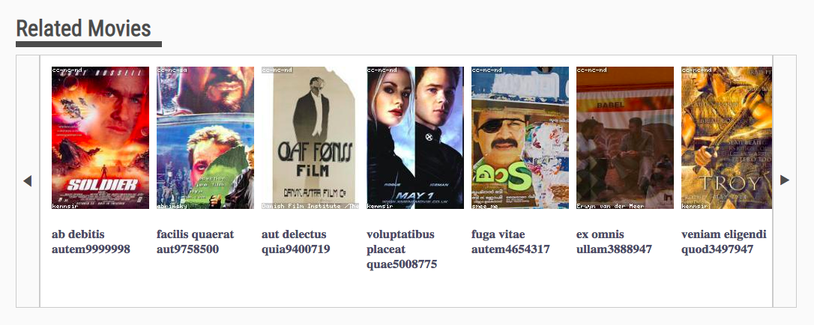

# Moovi - Related Movies Service

Front End React application. Related movies service with added carousel functionality, part of a movie ticketing application.



## Related Projects

  - https://github.com/teamName/repo
  - https://github.com/teamName/repo
  - https://github.com/teamName/repo
  - https://github.com/teamName/repo

## Table of Contents

1. [Usage](#Usage)
1. [Requirements](#requirements)
1. [Development](#development)

## Usage

> Some usage instructions

## Requirements

An `nvmrc` file is included if using [nvm](https://github.com/creationix/nvm).

- Node 6.13.0
- etc

## Development

### Installing Dependencies

From within the root directory:

```sh
npm install -g webpack
npm install
```

